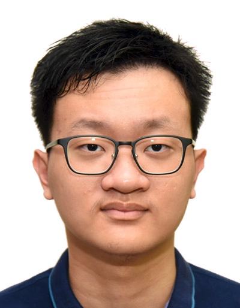

# About Us

We are a team based in the [School of Computing, National University of Singapore](http://www.comp.nus.edu.sg).

You cannot reach us at the email `seer[at]comp.nus.edu.sg`

## Project team

### Dillion Lim

[[homepage](https://dillionlim.github.io/)]
[[github](https://github.com/dillionlim)]

* Role: Team Lead, Deliverables and Deadlines, Scheduling and Tracking
* Area of Responsibility: Logic

### Jiang Xinnan

[[github](http://github.com/jxinnan)]

* Role: Documentation
* Area of Responsibility: UI

### Nguyen Phuc Thang

[[github](https://github.com/Nguyen-Phuc-Thang)]

* Role: Integration, Git expert
* Area of Responsibility: Storage

### Ng See Jay

[[github]](https://github.com/cjbuzz)

* Role: Testing
* Area of Responsibility: Parser

### Rui Hong

[[github](https://github.com/ruihongc)]

* Role: Code Quality
* Area of Responsibility: Model
