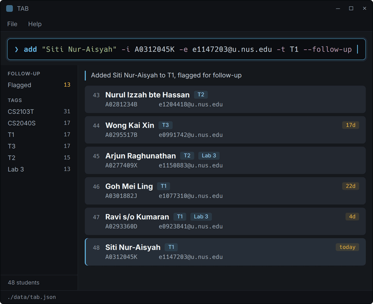
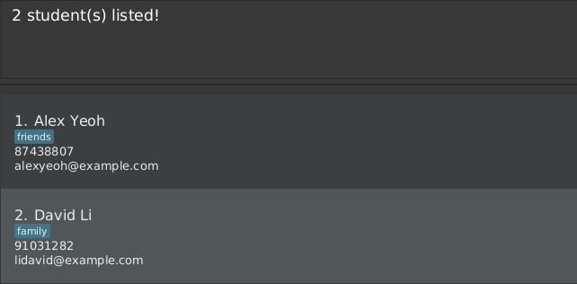

# TAB User Guide

TAB is a **desktop application for teaching assistants to manage student records, optimized for use through a Command Line Interface (CLI)** while retaining the benefits of a Graphical User Interface (GUI). If you type quickly, TAB can help you manage students faster than traditional GUI applications.

<!-- * Table of Contents -->
<page-nav-print />

--------------------------------------------------------------------------------------------------------------------

## Quick start

1. Ensure that Java `25` or later is installed on your computer.<br>
   **Mac users:** Ensure you have the precise JDK version prescribed [here](https://se-education.org/guides/tutorials/javaInstallationMac.html).

1. Download the latest `.jar` file from [here](https://github.com/AY2627S1-CS2103T-T16-1/tp/releases).

1. Copy the file to the folder you want to use as the _home folder_ for TAB.

1. Open a terminal, `cd` to the folder containing the JAR file, and run `java -jar tab.jar`.<br>
   A GUI similar to the one below should appear in a few seconds. Note how the app contains some sample data.<br>
   

1. Type a command in the command box and press Enter to execute it. For example, type **`help`** and press Enter to open the help window.<br>
   Some example commands you can try:

   * `list` : Lists all contacts.

   * `add John Doe -p 98765432 -e johnd@example.com` : Adds a student named `John Doe`.

   * `delete 3` : Deletes the 3rd contact shown in the current list.

   * `clear` : Deletes all contacts.

   * `exit` : Exits the app.

1. Refer to the [Features](#features) section below for details of each command.

--------------------------------------------------------------------------------------------------------------------

## Features

<box type="info" seamless>

**Notes about the command format:**<br>

* Words in `UPPER_CASE` are the parameters to be supplied by the user.<br>
  For example, in `add NAME`, replace `NAME` with a value such as `John Doe`.

* Items in square brackets are optional.<br>
  For example, `NAME [-t TAG]` can be used as `John Doe -t friend` or as `John Doe`.

* Items followed by `...` can appear zero or more times.<br>
  For example, `[-t TAG]...` may be omitted, or written as `-t friend` or as
  `-t friend -t family`.

* Parameters can be in any order.<br>
  For example, if the command specifies `-p PHONE_NUMBER -e EMAIL`,
  `-e EMAIL -p PHONE_NUMBER` is also acceptable. A parameter given before any
  option, such as the name in `add`, keeps its place at the front.

* `add` marks its fields with options such as `-p`, while `edit` marks them
  with prefixes such as `p/`. A value holding spaces goes in double quotes
  after an option, and needs no quotes after a prefix.

* Extraneous parameters for commands that take no parameters, such as `help`, `list`, `exit`, and `clear`, are ignored.<br>
  For example, `help 123` is interpreted as `help`.

* If you are using a PDF version of this document, be careful when copying and pasting commands that span multiple lines as space characters surrounding line-breaks may be omitted when copied over to the application.
</box>

### Viewing help: `help`

Shows a message explaining how to access the help page.


Format: `help`


### Adding a student: `add`

Adds a student to the student book.

Format: `add NAME -p PHONE_NUMBER [-e EMAIL] [-t TAG]...`

<box type="tip" seamless>

**Tip:** The email is optional. Record a student you only have a phone number
for, rather than inventing an address to satisfy the command. An email cannot
be removed once set, only replaced.
</box>

<box type="tip" seamless>

**Tip:** A student can have any number of tags, including zero. A tag may hold
spaces, hyphens and any script, so `Lab 3`, `needs-followup` and
`AY2627 Sem 1 CS2103T T16` are all valid.
</box>

<box type="tip" seamless>

**Tip:** A phone number may be written the way you would write it down:
`+65 9123 4567`, `6516-2727 ext 21`, or even
`1234 5678 (HP) 1111-3333 (Office)`. It only has to hold at least 3 digits.
</box>

<box type="tip" seamless>

**Tip:** A name may hold anything you would write on a roster: slashes,
hyphens, apostrophes, full stops, and any script. It only has to contain at
least one letter or number, in any writing system.
</box>

<box type="tip" seamless>

**Tip:** The name comes first and may hold spaces as it is, so
`add Ravi s/o Kumaran -p 91234567` needs no quotes at all. Slashes, hyphens and
apostrophes are ordinary characters here.

Use double quotes for an option value holding spaces, and for any value opening
with a hyphen, so that TAB does not read it as an option:
`add Siti Nur-Aisyah -p 84420917 -t "Lab 3"` and `add "-Ahmad" -p 84001122`.

To put a double quote or a backslash inside a value, write `\"` or `\\`:
`add Dwayne \"The Rock\" Johnson -p 91234567`.
</box>

Examples:
* `add John Doe -p 98765432 -e johnd@example.com`
* `add "Betsy Crowe" -t friend -e betsycrowe@example.com -p 1234567 -t criminal`
* `add "Ravi s/o Kumaran" -p 91234567 -e e0923841@u.nus.edu`
* `add Siti Nur-Aisyah -p 84420917 -e e1147203@u.nus.edu -t T1 -t "Lab 3"`
* `add 陈伟明 -p 98123344 -e e1077310@u.nus.edu`

Leading and trailing spaces are removed, repeated spaces inside a name are
collapsed to one, and invisible characters are discarded, so that a name is
always stored the way it looks.

If a field is rejected, TAB quotes the value it could not accept and says what
is wrong with it, rather than restating the whole rule:

```
> add John Doe -p 98765432 -e e1234567
Email "e1234567" is not valid: an email needs an @ between the local part and the domain
```

Once TAB can tell which value belongs to which field, every field is checked
before the command is refused, so a command with more than one mistake tells
you about all of them at once:

```
> add John Doe -e e1234567
Missing required field(s): -p PHONE
Email "e1234567" is not valid: an email needs an @ between the local part and the domain
```

### Listing all students: `list`

Shows a list of all students in the student book.

Format: `list`

### Editing a student: `edit`

Edits an existing student in the student book.

Format: `edit INDEX [n/NAME] [p/PHONE_NUMBER] [e/EMAIL] [t/TAG]...`

<box type="warning" seamless>

**Known limitation:** `edit` still marks its fields with prefixes, so a value
containing `p/`, `e/` or `t/` followed by a space is read as the start of
another field. A name that `add` accepts may therefore be impossible to type
into `edit`. Add the student afresh if you hit this.
</box>

* Edits the student at the specified `INDEX`. The index refers to the index number shown in the displayed student list. The index **must be a positive integer** 1, 2, 3, ...
* At least one of the optional fields must be provided.
* Existing values will be updated to the input values.
* When editing tags, all of the student's existing tags are removed; adding tags is not cumulative.
* To remove all of a student's tags, enter `t/` without a tag after it.

Examples:
*  `edit 1 p/91234567 e/johndoe@example.com` Edits the phone number and email address of the 1st student to be `91234567` and `johndoe@example.com` respectively.
*  `edit 2 n/Betsy Crower t/` Edits the name of the 2nd student to be `Betsy Crower` and clears all existing tags.

### Locating students by detail: `find`

Finds students whose details contain any of the given keywords.

Format: `find KEYWORD [MORE_KEYWORDS]`

* The search is case-insensitive; for example, `hans` matches `Hans`.
* Keyword order does not matter; for example, `Hans Bo` matches `Bo Hans`.
* The search covers all details of a student: name, phone number, email address and tags.
* Parts of details match; for example, `Han` matches `Hans`, and `912` matches the phone number `91234567`.
* Students matching at least one keyword are returned (an `OR` search); for example, `Hans Bo` returns `Hans Gruber` and `Bo Yang`.

Examples:
* `find john` returns `john` and `John Doe`
* `find alex david` returns `Alex Yeoh`, `David Li`<br>
  
* `find 91234 friend` returns students whose phone numbers or tags contain `91234` or `friend`

### Deleting a student: `delete`

Deletes the specified student from the student book.

Format: `delete INDEX`

* Deletes the student at the specified `INDEX`.
* The index refers to the index number shown in the displayed student list.
* The index **must be a positive integer** 1, 2, 3, ...

Examples:
* `list` followed by `delete 2` deletes the 2nd student in the student book.
* `find Betsy` followed by `delete 1` deletes the 1st student in the results of the `find` command.

### Clearing all entries: `clear`

Clears all entries from the student book.

Format: `clear`

### Exiting the program: `exit`

Exits the program.

Format: `exit`

### Saving the data

TAB automatically saves data after every command. You do not need to save manually.

### Editing the data file

TAB data is saved automatically as a JSON file `[JAR file location]/data/tab.json`. Advanced users are welcome to update data directly by editing that data file.

<box type="warning" seamless>

**Caution:**
If your changes make the data file invalid, TAB starts with an empty student book at the next run. The invalid file remains on disk until you run a command (TAB saves after every command). Still, we recommend backing up the file before editing it.<br>
Furthermore, certain edits can cause TAB to behave in unexpected ways (e.g., if a value entered is outside of the acceptable range). Therefore, edit the data file only if you are confident that you can update it correctly.
</box>

### Archiving data files `[coming in v2.0]`

_Details coming soon ..._

--------------------------------------------------------------------------------------------------------------------

## FAQ

**Q**: How do I transfer my data to another computer?<br>
**A**: Install TAB on the other computer and overwrite the data file it creates with the data file from your previous TAB home folder.

--------------------------------------------------------------------------------------------------------------------

## Known issues

1. **When using multiple screens**, if you move the application to a secondary screen, and later switch to using only the primary screen, the GUI will open off-screen. The remedy is to delete the `preferences.json` file created by the application before running the application again.
2. **If you minimize the Help Window** and then run the `help` command (or use the `Help` menu, or the keyboard shortcut `F1`) again, the original Help Window will remain minimized, and no new Help Window will appear. The remedy is to manually restore the minimized Help Window.

--------------------------------------------------------------------------------------------------------------------

## Command summary

Action     | Format, Examples
-----------|----------------------------------------------------------------------------------------------------------------------------------------------------------------------
**Add**    | `add NAME -p PHONE_NUMBER [-e EMAIL] [-t TAG]...` <br> e.g., `add James Ho -p 22224444 -t friend -t colleague`
**Clear**  | `clear`
**Delete** | `delete INDEX`<br> e.g., `delete 3`
**Edit**   | `edit INDEX [n/NAME] [p/PHONE_NUMBER] [e/EMAIL] [t/TAG]... `<br> e.g.,`edit 2 n/James Lee e/jameslee@example.com`
**Find**   | `find KEYWORD [MORE_KEYWORDS]`<br> e.g., `find James Jake`
**List**   | `list`
**Help**   | `help`
