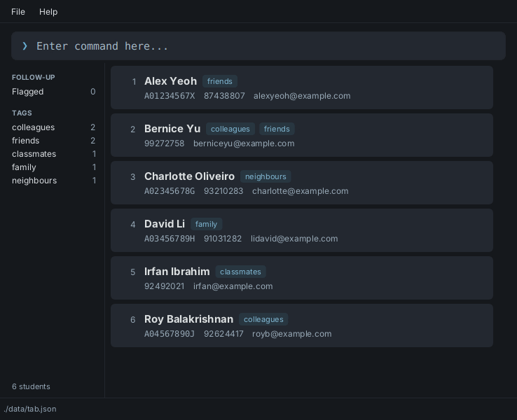
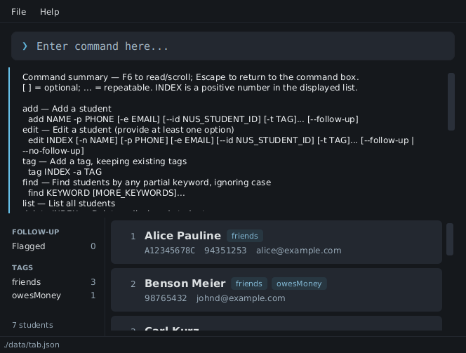

# TAB User Guide

TAB is a **desktop application for teaching assistants to manage student records, optimized for use through a Command Line Interface (CLI)** while retaining the benefits of a Graphical User Interface (GUI). If you type quickly, TAB can help you manage students faster than traditional GUI applications.

<!-- * Table of Contents -->
<page-nav-print />

--------------------------------------------------------------------------------------------------------------------

## Quick start

1. Ensure that Java `25` or later is installed on your computer.<br>
   TAB includes JavaFX `17.0.7`, used with an x64 JDK without bundled JavaFX
   (for Zulu, choose the `jdk` package).<br>
   **Mac users:** You can instead use Zulu JDK+FX `25.0.3`, installed by the
   [course's Mac setup guide](https://se-education.org/guides/tutorials/javaInstallationMac.html).
   This setup uses the JDK's JavaFX `25` and runs natively on Apple Silicon.<br>
   **Apple Silicon users choosing plain JDK + JavaFX 17:** Use an x64 JDK under
   Rosetta, as TAB's bundled JavaFX libraries target Intel Macs. This requirement
   does not apply to the course's native JDK+FX setup.

1. Download the latest `.jar` file from [here](https://github.com/AY2627S1-CS2103T-T16-1/tp/releases).

1. Copy the file to a folder you can write to, which will be the _home folder_ for TAB.
   If the folder is read-only, TAB can open but cannot save changes to student
   records or window preferences there. `list`, `find`, `help`, and `exit`
   still work. It reports a warning in the terminal
   if it cannot create its log file. Move TAB and any existing data to a
   writable folder before making changes you want to keep.

1. Open a terminal, `cd` to the folder containing the JAR file, and run `java -jar tab.jar`.<br>
   A GUI similar to the one below should appear in a few seconds. Note how the app contains some sample data.
   The picture shows TAB in use, so a fresh launch has an empty command box and no reply above the list.<br>
   

1. Type a command in the command box and press Enter to execute it. For example, type **`help`** and press Enter to show the command summary in the main window.<br>
   Some example commands you can try:

   * `list` : Lists all students.

   * `add John Doe -p 98765432 -e johnd@example.com --id A01234567X` : Adds a student named `John Doe` with an NUS Student ID.

   * `delete 3` : Deletes the 3rd student shown in the current list. `delete A01234567X` deletes by NUS Student ID instead.

   * `clear` : Asks before deleting all students. Type `y` and press Enter
     to confirm, or press Enter without a reply to cancel.

   * `exit` : Exits the app.

1. Refer to the [Features](#features) section below for details of each command.

--------------------------------------------------------------------------------------------------------------------

Text pasted into the command box keeps its word boundaries: tabs and line
breaks become spaces. This lets you paste names or values from spreadsheet
cells without joining their words. Pasted text remains one command; inspect
it before pressing Enter.

## Features

<box type="info" seamless>

**Notes about the command format:**<br>

* Words in `UPPER_CASE` are the parameters to be supplied by the user.<br>
  For example, in `add NAME`, replace `NAME` with a value such as `John Doe`.

* A command word may be typed in any case, so `list`, `List` and `LIST` all
  list your students. Only the first word is read this way: the rest of the
  command keeps the capitals you typed, so `Find -n Alex` still looks for `Alex`.
  Option spellings are case-sensitive, so `-P` is not the `-p` option.

* Items in square brackets are optional.<br>
  For example, `NAME [-t TAG]` can be used as `John Doe -t friend` or as `John Doe`.

* A vertical bar `|` separates alternatives; choose at most one and do not type the bar.<br>
  For example, `[--follow-up | --no-follow-up]` allows either option or neither.

* Items followed by `...` can appear zero or more times.<br>
  For example, `[-t TAG]...` may be omitted, or written as `-t friend` or as
  `-t friend -t family`.

* Parameters can be in any order.<br>
  For example, if the command specifies `-p PHONE -e EMAIL`,
  `-e EMAIL -p PHONE` is also acceptable. A parameter given before any
  option, such as the name in `add`, keeps its place at the front.

* Every command marks its fields with options such as `-p`. Value options also
  have descriptive long aliases such as `--phone`; the command-specific
  sections list them. Separate a value from its option with a space, as in
  `--phone 91234567`, or join it with an equals sign, as in
  `--phone=91234567`; short options accept both forms too. Only the first
  equals sign is a separator, so the rest belong to the value. A value holding
  spaces goes in double quotes after an option or after its equals sign, as in
  `--tag="Lab 3"`. Quote any value opening with a hyphen when using a space;
  after an equals sign it is already unambiguous. An equals sign still needs a
  value after it. Where `edit` allows an empty value, write the deliberate
  empty value as `OPTION=""`, for example `--email=""`.

* Commands that take no parameters (`help`, `list`, `exit`, and `clear`)
  reject unexpected input and report it without executing the command.<br>
  For example, `help 123` reports `help takes no arguments. Unexpected input:
  "123".` Whitespace after the command is accepted, but quoted values,
  including `""`, are still arguments.

* Invisible format characters are ignored wherever they appear, so a command
  word or an index copied from a web page with a direction mark or a zero-width
  space still runs as the command it looks like. The joiners some scripts need
  for shaping are the exception and are kept.

* If you are using a PDF version of this document, be careful when copying and pasting commands that span multiple lines as space characters surrounding line-breaks may be omitted when copied over to the application.
</box>

### Typing a command

The command line marks the parts of a command as you type, so a mistake is
visible before you press Enter:

* the command word is in the line's accent colour and bold
* an option such as `-p` is in mauve
* a value in double quotes is in green
* anything else is in ordinary text

If a command is refused, the whole line turns red until you start correcting
it. A command longer than the line scrolls with the caret, so you can always
see where you are typing, and selecting part of it (for example with
`Ctrl`+`A`) draws a band behind the selection.

<box type="tip" seamless>

**Tip:** The colours break a command where the parser breaks it, so if a value
you meant to quote is not coloured as a quoted value, the parser will not read
it as one either.
</box>

### Reusing recent commands

In the command box, press `Up` to recall the previous submitted command and
`Down` to move forward. Moving past the newest command restores the draft you
were typing before pressing `Up`. The caret moves to the end of recalled text,
and its colours follow the command shown. Press Enter to submit it again.

Rejected commands are included so you can correct a typo. Consecutive identical
submissions appear once; blank and whitespace-only replies are omitted. If the
box already shows the newest submission (for example after a rejection), the
first `Up` skips to the preceding entry when there is one. `Down` still returns
the rejected text. At the oldest entry, `Up` keeps the text unchanged;
with no history, both keys keep the text unchanged. Editing a recalled entry
does not change the saved command, and navigating away discards that edit.
History lasts only until TAB closes and is not saved in the data file.

### Mistyping a command word

If the first word of a command is not one TAB knows, the reply names the word
you typed, and names the commands it was likely meant to be:

* `del 3` answers `Unknown command "del". Did you mean delete?`
* `delte 3` answers `Unknown command "delte". Did you mean delete?`
* `eit` answers `Unknown command "eit". Did you mean edit or exit?`
* `qwerty` answers `Unknown command "qwerty". Enter help to see every command.`

A word that opens a command is read as that command being typed: `del` and
`dele` reach `delete`, `cle` reaches `clear`, and `e` reaches both `edit` and
`exit`. Every command the word opens is named, because TAB cannot tell which
of them you meant.

Any other word is matched letter by letter, and reaches a command when at most
two letters have to be added, removed, swapped or replaced to turn it into
that command, so `ls` reaches `list` and `dlte` reaches `delete`. A word that
is two letters out has to start with the same letter as the command, since the
first letter is the one you are least likely to get wrong. A word that is one
letter out may differ in it, so `felete` still reaches `delete`.

The comparison ignores case, so `Delte 3` is answered in the same way. A word
that reaches nothing, such as `dlt`, is answered with the pointer to `help`.
A word spelt correctly is no mistyping whatever case it is in: `List` and
`LIST` run `list` rather than being suggested back to you.

<box type="warning" seamless>

**Caution:** TAB never runs the command it suggests. Nothing is added, changed
or deleted by a mistyped command word, and what you typed stays in the command
box, so you can correct the word rather than type the command again.
</box>

### Reading the summary beside the list

The panel on the left of the window summarises the students the list is
showing, so you can see the shape of your cohort without running a command.

* **Flagged** counts the students marked as needing a follow-up.
* **Tags** lists each tag in use with the number of students carrying it,
  most used first. Tags used by the same number of students are listed
  alphabetically, ignoring case. Long tag names wrap onto multiple lines so
  you can read their endings beside the count. Scroll the tag list to see
  any rows below the visible area.
* The foot of the panel gives the total.

<box type="tip" seamless>

**Tip:** The summary describes the students currently listed, not the whole
student book. Run `find -n Alex` and it counts only the students that match;
run `list` to see the whole cohort again.
</box>

### Viewing help: `help`

Opens a help page inside TAB, replacing the student list and command box until
you leave help. It shows every supported command, its purpose and concise syntax,
option aliases, quoting rules and a shortcut to copy the User Guide address.

Use these pager keys immediately, without clicking or pressing Enter after a letter:

| Key | Action |
| --- | --- |
| Space, `f`, PgDn | Next screenful |
| `b`, PgUp | Previous screenful |
| Enter, `j`, Down | Next line |
| `k`, Up | Previous line |
| `d` / `u` | Forward / backward half a screenful |
| `g` / `G`, Home / End | Beginning / end |
| `q`, Esc | Return to commands |
| `c` | Copy the User Guide URL |

Press **c** to copy the complete User Guide address to your clipboard. The footer
confirms `User Guide URL copied.`; paste it into a browser to read the full guide.
Typing an unused key shows `Press q or Esc to return to the command box.` so you
can leave help before typing a command.

The footer keeps the navigation keys visible and shows your progress, or `(END)`
at the last screenful. Help has no scrollbars. Text wraps to the window width;
you can resize the window while reading. Paging keys stay at the beginning or
end when there is no more text in that direction. Press `q` or Esc to restore
the student list, previous result and any partially typed command, then enter
your next command. **F1** and **Help → Help** open the same page at the beginning
without submitting a partially typed command. Pager keys apply only while help is open.



Format: `help`


### Adding a student: `add`

Adds a student to the student book.

Format: `add NAME -p PHONE [-e EMAIL] [--id NUS_STUDENT_ID] [-t TAG]... [--follow-up]`

The value options accept these equivalent spellings: `-p` and `--phone`,
`-e` and `--email`, `--id` and `-i`, and `-t` and `--tag`. The spellings may
be mixed in one command, but giving the same field twice is an error even when
the two spellings differ.

<box type="tip" seamless>

**Tip:** The email is optional. Record a student you only have a phone number
for, rather than inventing an address to satisfy the command. To remove an
email entered by mistake, use `edit INDEX -e ""`.

An address may run to 254 characters, the longest an email address is allowed
to be, so no real address is turned away. A longer value is refused and TAB
tells you how long it was — useful when a copy-and-paste has picked up more
than you meant.
</box>

<box type="tip" seamless>

**Tip:** The NUS Student ID is optional. Give it with `--id`, or
use the shorter `-i` alias. It must contain between 1 and 32 ASCII letters and
digits, such as `A01234567X` or `E0123456`. Lowercase letters are accepted and
stored as uppercase. To remove an NUS Student ID entered by mistake, use
`edit INDEX --id ""`; a value containing only spaces clears it as well.

TAB uses the NUS Student ID to detect duplicate student records. Two students
may share a name, and students without an NUS Student ID are not treated as
duplicates. An `add` or `edit` is refused only when another student already
has the same NUS Student ID, ignoring letter case; the error names that ID and
the student who already holds it.
</box>

<box type="tip" seamless>

**Tip:** After a successful `add` or `edit`, TAB warns you when another student
has the same name, phone number, or email address. The record is still saved.
One warning line is shown for each matching field. It names up to two other
students, then counts any further matches. For example:

```
WARNING: Possible duplicate student: Alex Yeoh has the same email (alex@example.com).
Review the records and delete duplicates only if they are the same person.
```

Names and emails are compared without regard to letter case. Repeated,
leading, and trailing whitespace in names is insignificant, as are spaces in
phone numbers. The review advice appears once after all matching fields.

The warning is only a hint. It does not prove that two records describe the
same person, and it does not find misspelled names, email aliases, or phone
numbers whose punctuation differs. Review the records before deleting either
one. A matching NUS Student ID is handled separately and still refuses the
command, as described above.
</box>

<box type="tip" seamless>

**Tip:** A student can have any number of tags, including zero. A tag may hold
spaces, hyphens and any script, so `Lab 3`, `needs-followup` and
`AY2627 Sem 1 CS2103T T16` are all valid.
</box>

<box type="tip" seamless>

**Tip:** Add `--follow-up` when the student already needs a reply or another
action from you. This option takes no value, and the shorter `-f` alias is also
accepted. Without either option, the student starts unflagged.
</box>

<box type="tip" seamless>

**Tip:** A phone number may be written the way you would write it down:
`+65 9123 4567`, `6516-2727 ext 21`, or even
`1234 5678 (HP) 1111-3333 (Office)`. It only has to hold at least 3 digits.
</box>

<box type="tip" seamless>

**Tip:** A name may hold anything you would write on a roster: slashes,
hyphens, apostrophes, full stops, and any script. It only has to contain at
least one letter or number, in any writing system.
</box>

<box type="tip" seamless>

**Tip:** The name comes first and may hold spaces as it is, so
`add Ravi s/o Kumaran -p 91234567` needs no quotes at all. Slashes, hyphens and
apostrophes are ordinary characters here.

Use double quotes for an option value holding spaces, and for any value opening
with a hyphen, so that TAB does not read it as an option:
`add Siti Nur-Aisyah -p 84420917 -t "Lab 3"` and `add "-Ahmad" -p 84001122`.

To put a double quote or a backslash inside a value, write `\"` or `\\`:
`add Dwayne \"The Rock\" Johnson -p 91234567`.
</box>

Examples:
* `add John Doe -p 98765432 -e johnd@example.com`
* `add Alice Tan --phone=91234567 --email=alice@example.com --tag="Lab 3"`
* `add "Betsy Crowe" --tag friend --email betsycrowe@example.com --phone 1234567 --id A01234567X -t criminal`
* `add "Ravi s/o Kumaran" -p 91234567 -e e0923841@u.nus.edu`
* `add Siti Nur-Aisyah -p 84420917 -e e1147203@u.nus.edu -i a11472030k -t T1 -t "Lab 3"`
* `add Priya Nair -p 91234567 -e priya@example.com --follow-up`
* `add 陈伟明 -p 98123344 -e e1077310@u.nus.edu`

A student's NUS Student ID appears among their card's details and in successful
command feedback. A student without one has no placeholder or blank gap there.
A flagged student's card carries a `Needs follow-up` marker at its right-hand
edge, on the same line as the name, and the command result says so too.

A name too long for a card is shortened with an ellipsis in its middle, which
keeps both the start and the end of the name, so two students whose names begin
alike still read as two. Hover over any name the card cannot show in full,
whether it was shortened this way or left narrow by a crowded row, to see the
whole of it. NUS Student ID, phone and email share a line when they fit. Details
wrap onto another line when needed, so a long phone cannot hide the email.
A value wider than a whole line ends with an ellipsis; hover over it to see
its full value. Widening the window shows more text and brings details back
onto one line without changing the stored record.
At narrow widths, the name keeps its opening letters while tags give way to
a count of those hidden. When no chip fits, the count reads `N tags`; otherwise
it reads `N more…`. Hover over the count to read the hidden tag names.

When a student is added, the command result displays the new record
(`New student added: NAME; Phone: PHONE...`) so you can confirm the details
immediately. Consistent with the student card, optional fields appear in the
result only when present: an unflagged student or a student without an email
or tags leaves no empty placeholder labels in the message, and tags appear
in alphabetical order (ignoring case).

Leading and trailing spaces are removed, repeated spaces inside a name are
collapsed to one, and invisible characters are discarded, so that a name is
always stored the way it looks.

If a field is rejected, TAB quotes the value it could not accept and says what
is wrong with it, rather than restating the whole rule:

```
> add John Doe -p 98765432 -e e1234567
Email "e1234567" is not valid: an email needs an @ between the local part and the domain
```

Once TAB can tell which value belongs to which field, every field is checked
before the command is refused, so a command with more than one mistake tells
you about all of them at once:

```
> add John Doe -e e1234567
Missing required field(s): -p PHONE
Email "e1234567" is not valid: an email needs an @ between the local part and the domain
```

For example, an ID containing punctuation is rejected specifically:

```
> add John Doe -p 98765432 --id A0123-456X
NUS Student ID "A0123-456X" is not valid: a NUS Student ID can only contain ASCII letters and digits
```

### Listing all students: `list`

Shows a list of all students in the student book.

Format: `list`

TAB reports the number of displayed students: `Listed 0 students.` when the list is empty,
`Listed 1 student.` for a single student, and `Listed 24 students.` for several.

### Editing a student: `edit`

Edits an existing student in the student book.

Format: `edit INDEX [-n NAME] [-p PHONE] [-e EMAIL] [--id NUS_STUDENT_ID] [-t TAG]... [--follow-up | --no-follow-up]`

The value options accept these equivalent spellings: `-n` and `--name`, `-p`
and `--phone`, `-e` and `--email`, `--id` and `-i`, and `-t` and `--tag`.
The spellings may be mixed in one command, but giving the same field twice is
an error even when the two spellings differ.

<box type="tip" seamless>

**Tip:** `edit` reads field values the same way as `add`. A name holding slashes, hyphens or apostrophes needs nothing
done to it beyond the quotes any value with spaces takes:
`edit 1 -n "Ravi s/o Kumaran"`.
</box>

* Edits the student at the specified `INDEX`. The index refers to the index number shown in the displayed student list. The index **must be a positive integer** 1, 2, 3, ...
  The current search stays active after editing, so the index keeps referring to
  the same student when you repeat a command, as long as that student still
  matches the search. An edit that removes a matching detail, such as renaming
  the only `john` in the list, takes that student off the displayed list and
  shifts the remaining indices up. Check the displayed list before repeating a
  command after such an edit.
* The index comes first, before any option.
  An unquoted negative index reports both that the index must be positive and
  that the negative number is not an option. Extra words after a valid index
  are reported as unexpected values. Put a name change after `-n` rather than
  immediately after the index.
* At least one of the optional fields must be provided.
* Existing values will be updated to the input values.
* `--follow-up` (alias `-f`) sets follow-up; `--no-follow-up` (alias `-nf`) clears it and is
  available only with `edit`. New students are unflagged by default when added.
  Both options take no value, so forms such as `--follow-up=true` are refused.
  Repeating either request succeeds and keeps the requested state.
  Leaving both out preserves the student's follow-up status.
* Choose at most one follow-up option. Combining `--follow-up` or `-f` with
  `--no-follow-up` or `-nf` is rejected without changing any student details.
* To remove a student's email, use `-e ""` or `--email=""`. A quoted value
  containing only spaces also removes it. Leaving out `-e` keeps the email
  unchanged; a bare `-e` or `--email=` is an error. Clearing an already absent
  email succeeds.
* A new email may run to 254 characters, the same limit `add` applies. A longer
  value is refused, TAB tells you how long it was, and the student's details
  stay as they were.
* To remove a student's NUS Student ID, use `--id ""`, `--id=""`, or the
  corresponding `-i` form. Leaving the option out keeps the NUS Student ID
  unchanged; a quoted value containing only spaces removes it, while a bare
  option or an unquoted empty value such as `--id=` is an error. Clearing an
  already absent NUS Student ID succeeds. Name and phone are required and
  cannot be cleared.
* An edit may give two students the same name, but cannot give a student an NUS
  Student ID already held by another record. NUS Student ID matching ignores case.
  A saved edit produces the same likely-duplicate notes described under `add`
  only when a name, phone number, or email changed by that command matches
  another student. Unchanged fields are not reported again, and the edited
  student is not compared with its own earlier record.
* When editing tags, all of the student's existing tags are removed; adding tags is not cumulative.
  To add one tag while keeping existing tags, use [the `tag` command](#adding-one-tag-tag).
* To remove all of a student's tags, give `-t` an empty value: `-t ""` or
  `--tag=""`. A bare `-t` or unquoted `--tag=` is refused, so that a mistyped
  option is reported rather than read as a request to clear.

Examples:
*  `edit 1 --phone 91234567 --email johndoe@example.com` Edits the phone number and email address of the 1st student to be `91234567` and `johndoe@example.com` respectively.
*  `edit 1 --email ""` Removes the 1st student's email while keeping all other details.
*  `edit 2 --name "Betsy Crower" --tag ""` Edits the name of the 2nd student to be `Betsy Crower` and clears all existing tags.
*  `edit 1 --id A01234567X` Records or replaces the 1st student's NUS Student ID.
*  `edit 1 -i ""` Removes the 1st student's NUS Student ID while keeping all other details.
*  `edit 1 -n "Ravi s/o Kumaran"` Edits the name of the 1st student to be `Ravi s/o Kumaran`.
*  `edit 3 -p "+65 9123 4567" -t T1 -t "Lab 3"` Replaces the phone number and both tags of the 3rd student.
*  `edit 1 --follow-up` Flags the 1st student for follow-up. Repeating it keeps the flag set.
*  `edit 1 -f` Also sets follow-up, even if the student is already flagged.
*  `edit 1 --no-follow-up` Clears the flag. Repeating it keeps the flag cleared.
*  `edit 1 -nf` Also clears follow-up, even if the student is already unflagged.
*  `edit 2 -p 91234567 --follow-up` Updates the phone number and sets follow-up in one command.

A cleared email or NUS Student ID, a cleared tag set, and an explicitly set or cleared follow-up status are
saved at once, and return as they were when you next launch TAB. The command result displays the updated
record (`Edited student: NAME; Phone: PHONE...`) with fields formatted consistently
with the student card, omitting cleared or absent optional fields and sorting tags
alphabetically (ignoring case).

### Adding one tag: `tag`

Adds one tag to an existing student, keeping every existing tag and all other
details, including follow-up status.

Format: `tag INDEX -a TAG`

* Use the index shown in the displayed list, including after `find`. The index
  must be a positive integer and comes before the option. The current search
  stays active after tagging.
* `-a` selects addition; `--add` is its long alias. Supply exactly one tag per command; repeat the
  command to add another. For replacing the full tag set, use `edit INDEX -t TAG`.
  To remove one tag, use [`tag INDEX -r TAG`](#removing-one-tag-tag).
* A tag must contain at least one letter or number in any writing system.
  Symbols are allowed alongside them. Put a tag containing spaces or starting
  with a hyphen in double quotes. Escape a literal quote as `\"` and a
  backslash as `\\` inside a quoted value.
* Leading and trailing whitespace is removed and runs of whitespace become
  one space. Tags retain their letter case. When checking whether the student
  already has the tag, case and insignificant whitespace are ignored, so
  `Lab 3` and `lab  3` count as the same tag for this command.
* An existing tag reports `This student already has tag [TAG]. No changes made.`
  The reply uses the stored spelling: if the tag is `Lab 3`, entering `lab  3`
  reports `[Lab 3]`. Existing case variants entered through `add`,
  `edit` or a data file are kept; this command does not merge them.
  When several stored spellings match, the reply uses the first in the tag
  display order.
* An invalid index or tag, a missing value, or a repeated add option is refused
  without changing any student details or writing the data file. An empty
  quoted tag is invalid; it does not clear tags.
* If you omit an action option, the reply explains how to add or remove a tag. A tag entered
  directly after a valid index is reported as an unexpected value, and `-t`
  is reported as an unknown option. Use `tag 1 -a lab4` to add `lab4`.
* An unquoted negative index reports both that the index must be positive
  and that the negative number is not an option, followed by the action
  guidance.
* A successful addition is saved at once and remains after restarting TAB.
  The feedback starts with `Added tag [TAG]:` and shows the updated record.

Examples:

* `tag 1 -a T2` adds `T2` to the 1st displayed student while keeping existing tags.
* `tag 1 --add "Lab 3"` adds a tag containing a space.
* `tag 2 -a "Project A/B"` adds a tag containing a slash.
* `tag 2 -a "组 1"` adds a tag in another writing system.
* `tag 1 -a "-Lab"` adds a tag starting with a hyphen.

Examples of refused commands and their replies:

```text
tag 1 -t T2
There is no -t option.
To add a tag, use -a or --add, e.g. tag 1 -a "Lab 3". To remove a tag, use -r or --remove, e.g. tag 1 -r "Lab 3".

tag 1 lab4
Unexpected value after INDEX: "lab4". Put field values after an option.
Missing required field(s): -a TAG or -r TAG
To add a tag, use -a or --add, e.g. tag 1 -a "Lab 3". To remove a tag, use -r or --remove, e.g. tag 1 -r "Lab 3".

tag -1 -a T2
Index must be a positive integer.
There is no -1 option.
To add a tag, use -a or --add, e.g. tag 1 -a "Lab 3". To remove a tag, use -r or --remove, e.g. tag 1 -r "Lab 3".
```

### Removing one tag: `tag`

Removes one tag from an existing student, keeping unrelated tags and all other
details, including follow-up status.

Format: `tag INDEX -r TAG`

* `-r` selects removal; `--remove` is its long alias. Use exactly one action
  and one tag per command. Combining addition and removal, or repeating the
  removal option (including mixed aliases), is refused without saving changes.
* Indexes, quoting, valid tag characters and whitespace follow the
  [same rules as adding one tag](#adding-one-tag-tag). Option names are
  case-sensitive; tag matching ignores case and insignificant whitespace.
* If the tag is present, feedback starts with `Removed tag [TAG]:` using its
  stored spelling, followed by the updated student details. If records from
  `add`, `edit` or a hand-edited file hold several case variants of the same
  tag, all matching variants are removed. Feedback uses the first matching
  spelling in tag display order. Unrelated tags keep their spelling.
* If the tag is absent, TAB reports
  `This student does not have tag [TAG]. No changes made.` using your
  normalized input. The record, displayed list and saved file stay unchanged.
* An invalid index or tag, an empty quoted tag, or a missing value is refused
  with a specific error and leaves records and the saved file unchanged.
* Removing the last tag leaves a student with no general tags. Removing a
  general tag named `Needs follow-up` leaves the follow-up flag unchanged;
  use `edit INDEX --no-follow-up` to clear that flag.
* The current search stays active. If it matched only the removed tag, the
  student may disappear from the displayed list; use `list` to see them again.
* A successful removal is saved at once and remains after restarting TAB.

Examples:

* `tag 1 -r T2` removes `T2` from the 1st displayed student.
* `tag 1 --remove "  lab   3  "` removes `Lab 3`, ignoring case and extra spaces.
* `tag 2 -r "Project A/B"` removes a tag containing a slash.
* `tag 2 -r "组 1"` removes a tag in another writing system.
* `tag 1 -r "-Lab"` removes a tag starting with a hyphen.

### Locating students by detail: `find`

Finds students matching every supplied search term within its selected field.

Format: `find FIELD_OPTION TERM [FIELD_OPTION TERM]...`

Every term needs a field option. Each option takes one word or one double-quoted phrase.

| Field | Options | Example |
| --- | --- | --- |
| Name | `-n`, `--name` | `find -n Jason` |
| NUS Student ID | `--id`, `-i` | `find --id A0123` |
| Phone | `-p`, `--phone` | `find -p 9123` |
| Email | `-e`, `--email` | `find -e nus.edu` |
| Tag | `-t`, `--tag` | `find -t friend` |

* Matching is case-insensitive and allows partial values: `find -n jas` matches `Jason`.
* All terms use **AND** matching, within and between fields. There is no OR search mode.
  For example, `find -n Jason -t Lab -n Tan` requires both name terms and the tag term.
  The order of the options does not matter.
* Field options restrict each term to that field. `find -t friend` excludes students
  who have `friend` only in their name or email. Absent optional fields do not match.
* Repeat an option to require more terms. `find -n Jason -t lab -t tutorial` matches
  Jason Lim with tag `lab tutorial` and Jason Zhou with tags `lab 5` and `tutorial 3`,
  but excludes Jason Tan with only tag `lab`. Terms may match the same tag or different tags.
* Enclose a multi-word term in double quotes: `find -n "Jason Tan"` requires that whole
  phrase in the name. `find -t "lab tutorial"` requires the phrase within one tag;
  separate tags are never joined. Repeated spaces inside a phrase are collapsed to one space.
* Apostrophes are literal characters, so `find -n O'Brien` searches for `O'Brien`.
  Single quotation marks do not group words; use double quotes for phrases.
* Bare terms are refused, including a name given before any option. Use a field option
  for every term. An extra word after an option is also refused; repeat the option or quote a phrase.
  This replaces the earlier unqualified cross-field search syntax and OR matching.
  Follow-up status is not a searchable field.
* To include a literal double quote or backslash inside a term, escape it with a backslash:
  `\"` or `\\`. An unclosed quote or an empty or whitespace-only term is refused
  without changing the current student list.
* Quote a term starting with a hyphen, or attach it with `=`:
  `find -t "-Lab"` and `find --tag=-Lab` search for the literal tag text `-Lab`.
* Phone terms containing only digits, or digits and phone punctuation (`+`, `-`, `(`, `)`, `.`),
  also search the phone with all non-digit characters removed. `find -p 91234567`,
  `find -p 91234`, `find -p 9123-4567` and `find -p +6591234567` all match `+65 9123 4567`.
  Terms containing other characters, such as `"ext 21"` or `"9123 4567"`, match the stored text.
* TAB reports the number of matches: `Found 0 students.`, `Found 1 student.` or `Found 3 students.`.

Examples:
* `find -n john` returns students whose names contain `john`, including `John Doe`.
* `find -t "Lab 3"` returns students with a tag containing the phrase `Lab 3`.
* `find -n Alice -t "Lab 3"` requires both the name fragment and the tag phrase.
* `find -p 91234 -t friend` requires both the phone fragment and the tag fragment.
* `find --id a0123 -p 9123 -e nus.edu` requires all three field conditions.

### Deleting a student: `delete`

Deletes the specified student from the student book.

Format: `delete INDEX` or `delete NUS_STUDENT_ID` or `delete --id NUS_STUDENT_ID`

* An `INDEX` deletes the student at that position in the displayed student list.
* An `INDEX` **must be a positive integer** 1, 2, 3, ...
* An `NUS_STUDENT_ID` deletes the student who holds that ID, wherever they are in
  the book — even while a search is hiding them. The match ignores case.
* `--id NUS_STUDENT_ID` names the value as an ID, which an ID starting with a digit
  needs — the plain form would read it as an index. `-i` works in place of `--id`.
* The command result identifies the removed record (`Deleted student: NAME; Phone: PHONE...`)
  so you can verify exactly which student was deleted from the book.
* `delete` takes no field values, so a value found after the target is refused with
  `Unexpected value after INDEX: "..."`, naming the part to remove, as in
  `Unexpected value after INDEX: "2". delete accepts one index and nothing else.`

Examples:
* `list` followed by `delete 2` deletes the 2nd student in the student book.
* `find -n Betsy` followed by `delete 1` deletes the 1st student in the results of the `find` command.
* `delete A01234567X` deletes the student holding the NUS Student ID `A01234567X`.
* `delete a01234567x` deletes the same student, because matching an ID ignores case.
* `delete --id 1A2B3C` deletes the student whose NUS Student ID is `1A2B3C`, which the plain
  form would otherwise read as an index.
* `find -n Alex` followed by `delete A02345678G` deletes Charlotte Oliveiro, whose NUS Student
  ID is `A02345678G` in the sample data, even while the search hides her.

### Clearing all entries: `clear`

Asks for confirmation before clearing all entries from the student book.

Format: `clear`

TAB shows a prompt such as `Clear all 6 students? This cannot be undone. [y/N]`.
The count includes students hidden by a search. The records and saved file
stay unchanged until you reply in the command line and press Enter:

* `y` or `yes` deletes all students and saves the empty book. This cannot be undone.
* `n`, `no`, or Enter without a reply cancels without changing any records or the saved file.

Replies ignore case and surrounding whitespace: `Y`, `yEs`, and `yeS` also
confirm; `N` and `nO` also cancel. Cancellation is the `[y/N]` default.
Only the exact replies above are accepted: words such as
`yellow` and `nope` are invalid. Any other reply, including another command,
leaves the data unchanged and answers `Invalid reply. Enter y/yes or n/no
(Enter cancels).` The request to clear stays pending until you confirm or
cancel, so cancel first if you want to run a different command. Closing TAB
while the prompt is pending also leaves the student data unchanged. If the
book is already empty, TAB reports that there is nothing to clear and does
not ask for confirmation.

### Exiting the program: `exit`

Exits the program.

Format: `exit`

### Saving the data

TAB automatically saves changes to student records. You do not need to save manually.
If TAB cannot save a change, it reports the error and leaves the student records as
they were before the command. Commands that do not change student records, including
`list`, `find`, `help`, and `exit`, do not write to the data file. Clear prompts,
cancellation, and invalid replies also leave the saved file unchanged.

Window size and position are saved separately in `preferences.json` in TAB's
home folder. On launch, TAB keeps the saved size and position when they fit
an available screen. If a screen was disconnected, TAB moves the window onto
an available screen; oversized windows shrink to its usable area. This also
applies after a resolution or display-scaling change.
If the file contains only `null`, `guiSettings` is `null`, or the
file cannot be parsed, TAB opens with default window settings and rewrites the
preferences file when it can. This recovery does not change saved student records in `data/tab.json`.
If preferences cannot be saved, TAB prints a concise warning naming the path
and reason. It uses the loaded or default settings for that session. A warning
on exit means the window settings could not be saved; TAB still closes normally.

### Editing the data file

TAB data is saved automatically as a JSON file `[JAR file location]/data/tab.json`. Advanced users are welcome to update data directly by editing that data file.

Save the file as **UTF-8**, with or without a leading byte order mark (BOM).
TAB accepts both forms and preserves accented letters and other Unicode text.
Files saved in another encoding, such as Windows-1252 (ANSI), may contain
invalid UTF-8. TAB rejects those files without changing their bytes and asks
you to reopen them with their original encoding and save them as UTF-8.

Field names are case-sensitive. Each student record accepts `name`, `phone`,
`email`, `nusStudentId`, `tags` and `flag`. The removed `address` field is still
accepted and ignored for compatibility with older files. Other keys, such as
`nusStudentID`, `Email` or `tag`, stop loading with an error naming the unknown
key, student record number (counting from 1), and name when present, rather
than silently losing that value on the next save.
The top-level object accepts `students` and an optional `_comment` description.
Correct the spelling or remove the unsupported field, then restart TAB; the
rejected file stays unchanged.

A student who needs follow-up has `"flag": true` in their JSON record. An
unflagged student normally has no `flag` key; absence, `false`, and `null` all
mean that no follow-up is needed. Data files created before this field existed
continue to load, with every record that lacks the key treated as unflagged.

A student with an NUS Student ID has a `"nusStudentId"` string such as
`"A01234567X"` in their JSON record. The key is optional: a missing key or
`null` means that no NUS Student ID has been recorded. A non-null value must
contain between 1 and 32 ASCII letters and digits. TAB accepts lowercase letters
and saves valid IDs in uppercase.

TAB identifies duplicate records by NUS Student ID, ignoring letter case. Two
records with the same name load when their NUS Student IDs differ or either ID
is absent. Two records with the same NUS Student ID make the file unreadable;
the startup error names the repeated ID and both record locations so that you
can correct it. Phone numbers and emails are searchable details rather than
identity keys.

An email key is optional: a missing key, `null`, an empty string, or a string
containing only spaces means that no email has been recorded. TAB removes
leading and trailing spaces from a non-empty saved email before validating it.

<box type="warning" seamless>

**Caution:**
If your changes make the data file unreadable, TAB shows an error at the next
run instead of opening the main window. The error identifies `data/tab.json`
and, when possible, the affected student record or field. For a JSON syntax
error with a usable location, it gives the line and column and shows a short,
line-numbered excerpt around the mistake. Long lines are shortened around the
error instead of being shown in full. Without a usable location, it gives a
concise explanation without showing the file contents. TAB leaves the file
unchanged so that you can repair or replace it, then restart TAB.<br>
Saved email addresses longer than 254 characters are rejected before validation
because their shape can otherwise exhaust Java's stack. This is the same limit
used by commands. We still recommend backing up the file before editing it.
</box>

### Archiving data files `[coming in v2.0]`

_Details coming soon ..._

--------------------------------------------------------------------------------------------------------------------

## FAQ

**Q**: How do I transfer my data to another computer?<br>
**A**: Install TAB on the other computer, then copy `data/tab.json` from your
previous TAB home folder to the same place beside the new JAR, creating the
`data` folder if it is not there. A new install has no data file to overwrite:
TAB writes one only when a command changes a record, so a fresh TAB that has
only been looked at leaves the folder without it. Copy the file while TAB is
closed, since TAB rewrites it from its own copy at the next change.

--------------------------------------------------------------------------------------------------------------------

## Known issues

No known issues are listed at this time.

--------------------------------------------------------------------------------------------------------------------

## Command summary

Action     | Format, Examples
-----------|----------------------------------------------------------------------------------------------------------------------------------------------------------------------
**Add**    | `add NAME -p PHONE [-e EMAIL] [--id NUS_STUDENT_ID] [-t TAG]... [--follow-up]` <br> Alternate spellings: `-p`/`--phone`, `-e`/`--email`, `--id`/`-i`, `-t`/`--tag`; `OPTION=VALUE` is also accepted <br> e.g., `add James Ho --phone=22224444 -i=A01234567X --tag=friend -t colleague --follow-up`
**Clear**  | `clear`, then `y`/`yes` to confirm; `n`/`no` or an empty reply to cancel (replies ignore case)
**Delete** | `delete INDEX` or `delete NUS_STUDENT_ID` or `delete --id NUS_STUDENT_ID`<br> The ID option, spelled `-i`/`--id` or `--id=VALUE`, is what an ID starting with a digit needs<br> e.g., `delete 3`, `delete A01234567X`, `delete --id 1A2B3C`
**Edit**   | `edit INDEX [-n NAME] [-p PHONE] [-e EMAIL] [--id NUS_STUDENT_ID] [-t TAG]... [--follow-up \| --no-follow-up]`<br> Alternate value spellings: `-n`/`--name`, `-p`/`--phone`, `-e`/`--email`, `--id`/`-i`, `-t`/`--tag`; `OPTION=VALUE` is also accepted <br> Follow-up aliases: `-f` sets; `-nf` clears.<br> e.g., `edit 2 --name="James Lee" --id=A01234567X`
**Tag**    | `tag INDEX -a TAG` or `tag INDEX -r TAG` <br> Alternate spellings: `--add`, `--remove`; `OPTION=VALUE` is also accepted <br> e.g., `tag 1 --add="Lab 3"`, `tag 1 --remove="Lab 3"`
**Find**   | `find FIELD_OPTION TERM [FIELD_OPTION TERM]...`<br> e.g., `find -n Jason -t lab -t tutorial` (all terms required)
**List**   | `list`
**Exit**   | `exit`
**Help**   | `help` (also `F1` or Help menu); Space/`b` to page, `c` to copy the guide URL, `q`/Esc to return
**Recall** | `Up` / `Down` in the command box; session only
